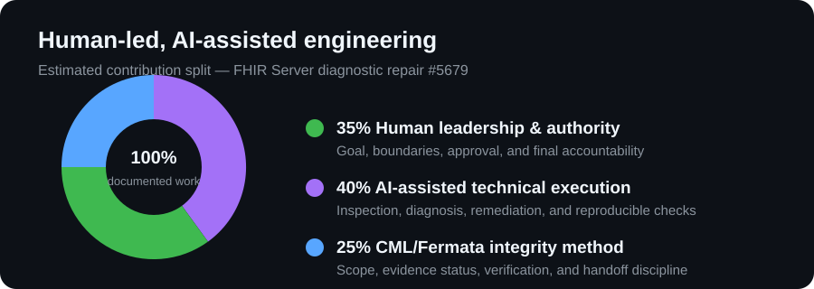

# S. J. 

### CML / Fermata - Human-led, AI-assisted engineering

> Trust Through Continuity.

I design and build systems for disciplined AI-assisted work. My focus is not asking an AI to "fix things" without accountability. I use **Continuity Markup Language (CML)** and the **Fermata** workflow to keep the assignment, scope, evidence, tests, decisions, and handoff visible from start to finish.

## How I work

- **Human-led:** I choose the goal, approve the scope, review the work, and own the final decision.
- **Evidence-bound:** A local change, a passing test, upstream review, and a merged result are different states. I do not blur them together.
- **Focused:** I start with the smallest useful task, protect the stated boundaries, and avoid unrelated changes.
- **Review-ready:** I prepare clear diffs, relevant checks, and an honest handoff for maintainers or collaborators.
- **Quiet integrity:** The work record matters more than hype. Reviews, receipts, and follow-through are the proof.

## What I am building

- **Continuity Markup Language (CML):** an experimental, renderer- and domain-neutral language and associated tooling for representing, validating, inspecting, and reporting continuity and state constraints.
- **Fermata:** a local, human-governed workflow for reading, verifying, preparing, testing, documenting, and handing off technical work. It stops before external actions.
- **CML reference tooling:** compiler, validation, canonical export, adapters, and reproducible checks for continuity-focused workflows.

## Working with AI responsibly

AI can help inspect, explain, draft, test, and prepare work. It does not replace responsibility.

For every material result, I keep the state visible:

- `IMPLEMENTED` - changed in a named artifact with direct evidence.
- `VERIFIED` - checked against a reproducible test or authoritative record.
- `OBSERVED` - directly seen but not independently reverified.
- `INFERENCE` - a reasoned conclusion from the available evidence, not direct proof.
- `HYPOTHESIS` - a testable explanation that remains unproven.
- `PROPOSAL` - suggested, not yet performed.
- `UNKNOWN` - not established by available evidence.

I do not present a proposal as a repair, a local test as upstream acceptance, or an open pull request as a completed result.

## A transparent collaboration record

### FHIR Server diagnostic repair

For [microsoft/fhir-server issue #5679](https://github.com/microsoft/fhir-server/issues/5679) and [pull request #5829](https://github.com/microsoft/fhir-server/pull/5829), this is the honest estimated split of the work:

- **35% Human leadership and authority:** I selected the goal, set the boundaries, approved the submission, and retain the final decision.
- **40% AI-assisted technical execution:** AI helped inspect, diagnose, draft, remediate, and run reproducible checks.
- **25% CML/Fermata integrity method:** CML and Fermata kept scope, evidence status, verification, and handoff explicit.

This is an estimate of contribution to the process, not a legal authorship, ownership, or upstream-acceptance claim. CML/Fermata is a human-governed method, not a separate author.

## Public documentation and work record

Public documentation is maintained in the [CML GitHub Work Record](https://github.com/cstolting-collab/CML-GitHub-Work-Record).

It contains:
- source-linked engineering records
- exact revisions and validation evidence
- CI results and unresolved gates
- dated journals and handoff state
- CML/Fermata workflow documentation

The public record separates **implemented**, **verified**, **observed**, and **unresolved** states. An open pull request is never presented as a completed result, and a local or fork validation run is never presented as upstream acceptance.

Current public example: [OpenAI Go PR #932](https://github.com/openai/openai-go/pull/932), where the current contribution was synchronized to upstream, repaired after independent CI exposed a regression-fixture defect, and revalidated through lint, Go 1.25/1.26 tests, supported-version checks, govulncheck, CodeQL, and Castiron. Upstream OpenAI CI authorization remains a separate gate.

## Available for focused work

I am open to well-scoped, evidence-friendly assignments involving:

- GitHub issue or review investigation
- Small repair preparation with relevant tests
- Documentation, workflow, and release-readiness review
- AI-assisted evaluation or continuity-focused tooling
- Clear technical handoffs for a maintainer's review

If you have a bounded task, open an issue with the goal, affected area, constraints, and expected handoff. I will respond with the scope I can honestly support.

---

**Human-led. AI-assisted. Evidence-bound.**
