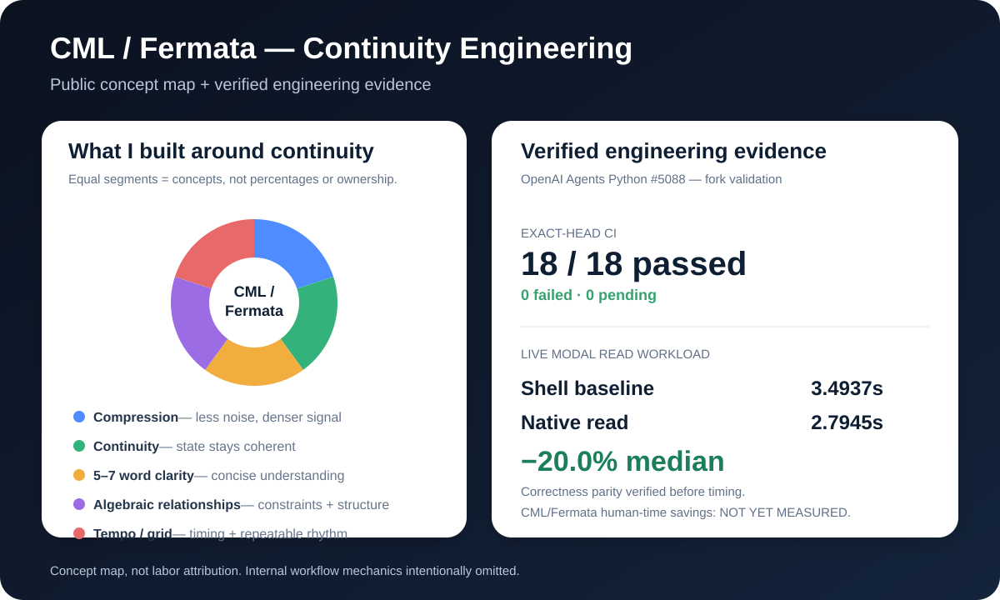

# S. J.

## CML / Fermata — Continuity Engineering

> **Trust Through Continuity.**

I am building a human-led way to make AI-assisted technical work **clearer, more continuous, and easier to verify**.

My work began with a practical question: *what happens when complex work has to survive compression, timing, tool changes, long handoffs, and repeated validation without losing its meaning?*

That led me to **Continuity Markup Language (CML)** and **Fermata**.

## What I built

CML/Fermata brings together several ideas I have been studying and testing:

| Area | What it is trying to protect |
| --- | --- |
| **Compression** | Reduce noise while preserving the important state. |
| **Harmonic continuity** | Keep related work coherent as it moves across steps and tools. |
| **5–7 word clarity** | Compress instructions into short, stable units that are easier to understand and carry forward. |
| **Algebraic relationships** | Treat constraints, dependencies, and state changes as relationships that can be checked rather than guessed. |
| **Music tempo / grid thinking** | Use timing, pacing, repetition, and rhythm as a way to reason about continuity and drift. |
| **Validation** | Use lint, tests, CI, benchmarks, and exact revisions to prove what actually happened. |

These are public descriptions of the concepts. The internal orchestration and workflow mechanics are intentionally not published here.

## Why it matters

AI can generate a lot of output. The harder problem is keeping work coherent from the first instruction to the final verified result.

I use CML/Fermata to support work that is:

**compressed without becoming vague · continuous without becoming rigid · structured without losing human judgment · timed without rushing · verified before being called complete**

The goal is not autonomous software making decisions for people. The goal is a system that keeps enough context, evidence, and structure intact for a human to remain in control.

## What has been measured

A recent public validation candidate for [OpenAI Agents Python issue #5088](https://github.com/openai/openai-agents-python/issues/5088) gives one concrete engineering example.

At exact benchmark head `a67a69d0313ea2d216318cf4e05dc431bfde48a7`:

- **18 / 18 exact-head CI jobs passed**
- live Modal workload benchmark: **SUCCESS**
- shell-read median: **3.4937s**
- native-read median: **2.7945s**
- observed code-path median delta: **−20.0%**
- correctness parity was verified before timing
- sandbox startup was measured separately and excluded

Benchmark: [run 35788913197](https://github.com/cstolting-collab/openai-agents-python/actions/runs/35788913197)  
Exact-head matrix: [run 35788918171](https://github.com/cstolting-collab/openai-agents-python/actions/runs/35788918171)

That **−20.0%** result belongs to the Modal implementation measurement. It is **not** a claim that CML/Fermata itself saves 20% of human time. A controlled human-time comparison has not yet been measured.

## What CML/Fermata contributed to that work

The contribution is easier to describe as **continuity discipline** than as a percentage:

- keep the problem boundary visible
- preserve evidence through iteration
- distinguish implementation from verification
- use lint and CI as feedback rather than decoration
- require a real workload before making a performance claim
- retain exact revision identity
- stop short of claiming upstream acceptance when only fork evidence exists

That is the part of the work I want people to be able to see.

## Evidence language

I keep a strict distinction between:

`IMPLEMENTED` · `VERIFIED` · `OBSERVED` · `INFERENCE` · `HYPOTHESIS` · `PROPOSAL` · `UNKNOWN`

A local change is not an upstream merge. A passing fork run is not maintainer acceptance. A benchmark-ready harness is not measured evidence. A measured result is not automatically a production result.

## Public work record

The detailed source-linked record is maintained in the **[CML GitHub Work Record](https://github.com/cstolting-collab/CML-GitHub-Work-Record)**.

Recent evidence:

- [OpenAI Agents Python #5088 — verified Modal performance evidence](https://github.com/cstolting-collab/CML-GitHub-Work-Record/blob/main/journals/2026-09-22.md)
- [Real-Workload Performance Evidence Standard](https://github.com/cstolting-collab/CML-GitHub-Work-Record/blob/main/standards/real-workload-performance.md)
- [OpenAI Codex Security #973 validation record](https://github.com/cstolting-collab/CML-GitHub-Work-Record/blob/main/journals/2026-09-22.md)

## Collaboration

I am interested in bounded, evidence-friendly work involving GitHub issues, validation, technical investigation, documentation, AI evaluation, continuity tooling, and engineering handoffs.

I do not need sole credit for a field to show what I contributed. The foundations belong to many people. This page documents the specific continuity ideas, tools, experiments, and engineering work I am contributing to that larger ecosystem.

---

**Human-led. AI-assisted. Evidence-bound.**
