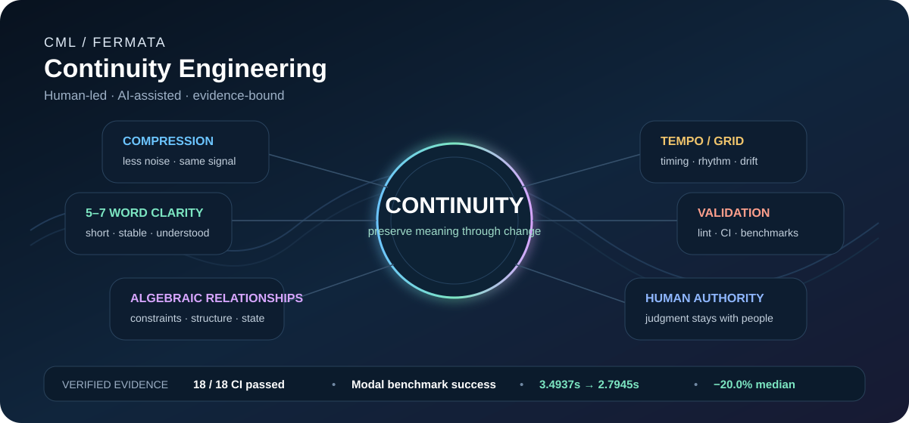

# S. J.

### CML / Fermata — Continuity Engineering

**Trust Through Continuity.**

*Human-led · AI-assisted · evidence-bound*

## Continuity is the center

**Continuity is not one feature beside the others. It is the thing the others are protecting.**

I am building **Continuity Markup Language (CML)** and **Fermata** around a simple problem: complex work should be able to move through compression, timing, tools, revisions, and validation **without losing its meaning, state, or human authority**.

CML is my way of making continuity visible enough to inspect. Fermata is the disciplined working method around it.

### The public shape of the work

**Continuity** — preserve meaning and state through change.  
**Compression** — reduce noise without throwing away the important signal.  
**5–7 word clarity** — create short, stable units that are easier to carry forward.  
**Algebraic relationships** — reason about constraints, dependencies, and state changes structurally.  
**Tempo / grid thinking** — use timing, rhythm, pacing, and drift as continuity signals.  
**Validation** — use lint, tests, CI, benchmarks, and exact revisions to establish what actually happened.

The internal orchestration and workflow wrapper are intentionally not published here.

## What this looks like in engineering

A recent public validation candidate for [OpenAI Agents Python #5088](https://github.com/openai/openai-agents-python/issues/5088) provides a concrete example.

**Verified on exact benchmark head `a67a69d0313ea2d216318cf4e05dc431bfde48a7`:**

- **18 / 18** exact-head CI jobs passed
- live Modal workload benchmark: **SUCCESS**
- shell-read median: **3.4937s**
- native-read median: **2.7945s**
- observed code-path median delta: **−20.0%**
- correctness parity verified before timing
- sandbox startup measured separately and excluded

[Benchmark evidence](https://github.com/cstolting-collab/openai-agents-python/actions/runs/35788913197) · [Exact-head CI matrix](https://github.com/cstolting-collab/openai-agents-python/actions/runs/35788918171)

> The **−20.0%** result is the measured Modal implementation result. It is not a claim that CML/Fermata saves 20% of human time. Human-time savings have not yet been measured in a controlled comparison.

## Why I keep building this

AI can produce output quickly. The harder problem is preserving enough continuity that the work remains understandable, testable, attributable, and safe to hand to the next person or tool.

That is where my work sits:

**less noise · stronger continuity · clearer structure · better timing · visible evidence**

I do not need to claim an entire field. I want the specific contribution to be visible enough that other people can understand it, test it, improve it, or build from it.

## Evidence discipline

I keep these states separate:

`IMPLEMENTED` · `VERIFIED` · `OBSERVED` · `INFERENCE` · `HYPOTHESIS` · `PROPOSAL` · `UNKNOWN`

A passing fork run is not upstream acceptance. A measured benchmark is not automatically a production result. A proposal is not a repair.

## Public record

The source-linked engineering record lives in the **[CML GitHub Work Record](https://github.com/cstolting-collab/CML-GitHub-Work-Record)**.

[September 22 evidence journal](https://github.com/cstolting-collab/CML-GitHub-Work-Record/blob/main/journals/2026-09-22.md) · [Real-Workload Performance Evidence Standard](https://github.com/cstolting-collab/CML-GitHub-Work-Record/blob/main/standards/real-workload-performance.md)

---

**Human-led. AI-assisted. Evidence-bound.**

