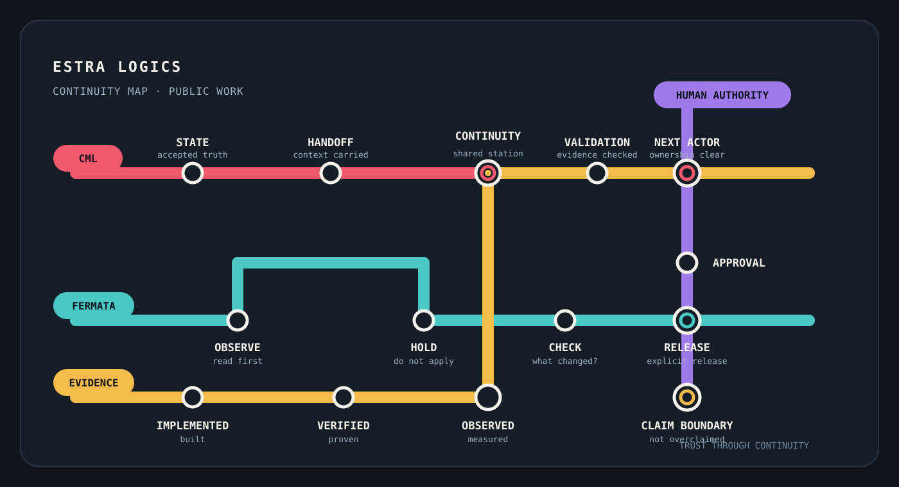

# Estra Logics

**Continuity engineering for human-led work.**

CML is **Continuity Markup Language**. Fermata is the human-led method around it. Together, they ask one practical question: when work changes hands, tools, speed, or form, what must remain true?

## Follow a route

- **CML** — state → handoff → continuity → validation → next actor
- **Fermata** — observe → HOLD → check → release
- **Evidence** — implemented → verified → observed → claim boundary
- **Human authority** — approval remains explicit for external work and final claims

## Start here

- [CML GitHub Work Record](https://github.com/cstolting-collab/CML-GitHub-Work-Record) — public, evidence-bound engineering record
- [Latest evidence journal](https://github.com/cstolting-collab/CML-GitHub-Work-Record/blob/main/journals/2026-09-22.md)
- [Performance evidence standard](https://github.com/cstolting-collab/CML-GitHub-Work-Record/blob/main/standards/real-workload-performance.md)

## One verified engineering result

For [OpenAI Agents Python #5088](https://github.com/openai/openai-agents-python/issues/5088), the exact benchmark head passed **18 / 18** CI jobs. A live Modal workload measured a **3.4937s** shell-read median and a **2.7945s** native-read median: a **−20.0% observed code-path median delta** after correctness parity was verified.

[Benchmark evidence](https://github.com/cstolting-collab/openai-agents-python/actions/runs/35788913197) · [Exact-head CI matrix](https://github.com/cstolting-collab/openai-agents-python/actions/runs/35788918171)

> This is a measured implementation result, not a claim of 20% human-time savings.

## Public boundary

The internal workflow wrapper is not published. The public record shows the ideas, evidence, and engineering outcomes—not private operating mechanics.

---

*Trust through continuity · Human-led · AI-assisted · Evidence-bound*
