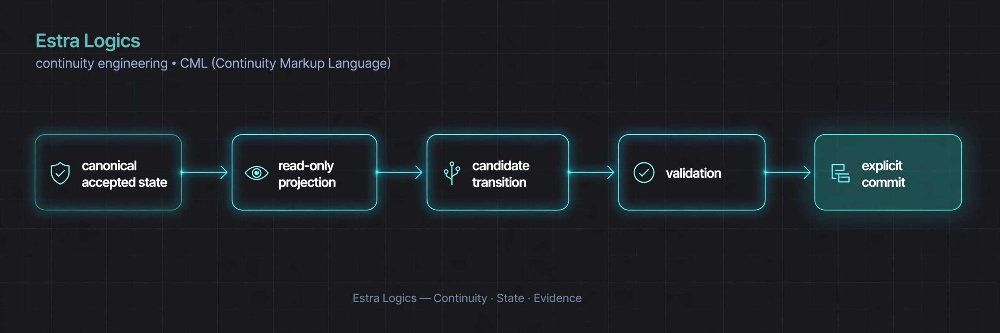

# Sherrie J — Estra Logics

**Continuity engineering for stateful AI and software systems.**

I develop CML (Continuity Markup Language) and document software investigation, validation, and recovery work. My focus is keeping accepted state, supporting evidence, and the next action understandable as a system changes.

> Human-led. AI-assisted. Evidence-bound.

## Start here

| Project | Purpose | Where to begin |
| --- | --- | --- |
| **[CML-Trust](https://github.com/cstolting-collab/CML-Trust)** | Alpha tooling for recording external continuity observations and preserving evidence history. | Setup, scope, and validation documentation |
| **[Engineering Work Record](https://github.com/cstolting-collab/CML-GitHub-Work-Record)** | Dated investigations, contribution records, validation results, and unresolved work. | Source-linked journals |
| **[Pattern Atlas](https://github.com/cstolting-collab/pattern-atlas)** | A local-first timeline and relationship-mapping tool for source-noted records. | Browser-based prototype and usage guide |
| **[CML Local Alpha](https://github.com/cstolting-collab/CML-Local-Alpha)** | Local static checker with accepted-state recovery and offline-verifiable receipts — not a standard, runtime, or safety system. | [README](https://github.com/cstolting-collab/CML-Local-Alpha#readme) · [Evidence boundary](https://github.com/cstolting-collab/CML-Local-Alpha/blob/main/WHY_CML.md#evidence-boundary) · [Alpha.2 release](https://github.com/cstolting-collab/CML-Local-Alpha/releases/tag/v0.1.0-alpha.2) |

[Browse the public project directory](PROJECTS.md) for the full account structure, including upstream contribution forks.

## Engineering approach

CML research explores a continuity flow:

**Canonical accepted state → read-only projection → candidate transition → validation → explicit commit**

External observations remain separate from accepted state. Each implementation has its own documented scope and limitations.

A PASS means the exact saved text met the named compiler snapshot's static rules. It does not establish runtime execution, rendering, timing verification, safety certification, human-behavior proof, deployment, or launch authority.

My work records distinguish implementation, test results, observations, and open questions. Dated evidence accompanies technical claims; a passing fork test does not establish upstream acceptance or production readiness.

## Open-source collaboration

I contribute through investigation, scoped patches, regression checks, and documented handoffs. Forks retain their original authorship and licenses. For example, [my Agent Boundary Check fork](https://github.com/cstolting-collab/agent-boundary-check) builds on [Sylvester Kaczmarek’s upstream project](https://github.com/sylvesterkaczmarek/agent-boundary-check).

## Review and collaboration

For a technical discussion, open an issue in the relevant public project with the problem, expected behavior, and a reproducible example where possible.

**Estra Logics · Continuity · State · Evidence**
