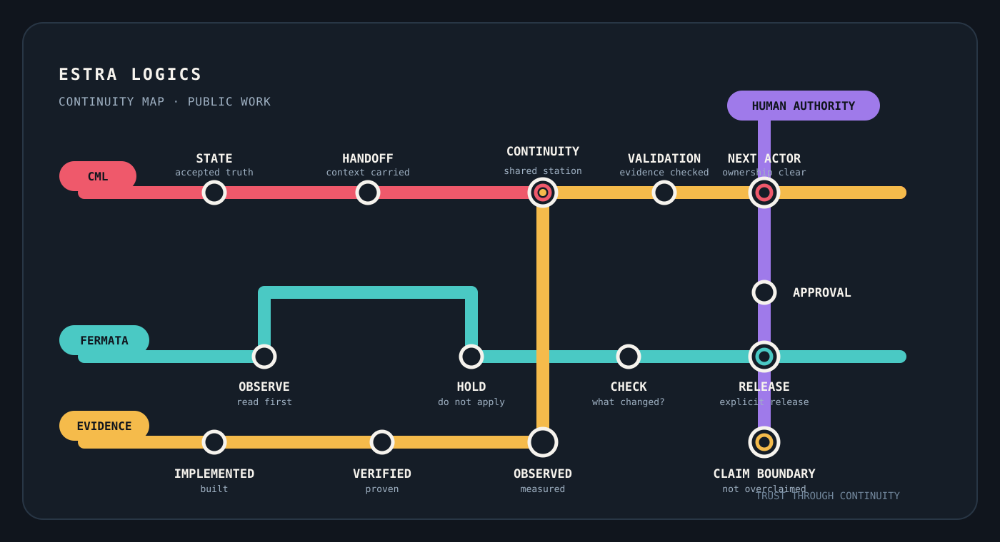
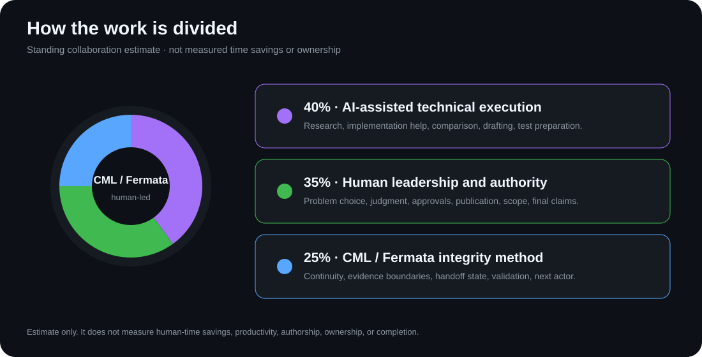

# Estra Logics

**Continuity engineering for human-led work.**

CML is **Continuity Markup Language**. Fermata is the human-led method around it. Together, they ask one practical question: when work changes hands, tools, speed, or form, what must remain true?

## Collaboration structure

These percentages are a **standing collaboration estimate**, not measured human-time savings, productivity, ownership, or completion. Measured engineering results are reported separately.

## Follow a route

- **CML** — state → handoff → continuity → validation → next actor
- **Fermata** — observe → HOLD → check → release
- **Evidence** — implemented → verified → observed → claim boundary
- **Human authority** — approval remains explicit for external work and final claims

## Currently accepting issues

I am currently accepting software issues for investigation and repair where the repository is public or I have explicit authorization to work on it.

Work begins with reproduction and evidence. A fix is not treated as complete until its validation state, remaining limitations, and handoff are clear. Open-source investigation does **not** require financial support.

## Start here

- [CML GitHub Work Record](https://github.com/cstolting-collab/CML-GitHub-Work-Record) — public, evidence-bound engineering record
- [Latest evidence journal](https://github.com/cstolting-collab/CML-GitHub-Work-Record/blob/main/journals/2026-09-22.md)
- [Performance evidence standard](https://github.com/cstolting-collab/CML-GitHub-Work-Record/blob/main/standards/real-workload-performance.md)

## Outside contributions — current readback

On **29 Sep 2026**, I re-read the public upstream contribution record rather than treating open PRs as completed work.

- **12** external upstream pull requests located
- **8** remain open
- **3** were closed after equivalent/original fixes merged upstream
- **1** was closed unmerged
- **CISA gh-skeleton #64** has an explicit reviewer approval with the prior blocker resolved
- **Semantic Kernel #14454** received a new review finding on 28 Sep; the contributor branch was updated on 29 Sep with an `Annotated` metadata fallback and regression coverage
- open work remains bounded by maintainer review, CI, or explicit validation gaps

[Full 29 Sep contribution audit](https://github.com/cstolting-collab/CML-GitHub-Work-Record/blob/main/journals/2026-09-29.md)

## One verified engineering result

For [OpenAI Agents Python #5088](https://github.com/openai/openai-agents-python/issues/5088), the exact benchmark head passed **18 / 18** CI jobs. A live Modal workload measured a **3.4937s** shell-read median and a **2.7945s** native-read median: a **−20.0% observed code-path median delta** after correctness parity was verified.

[Benchmark evidence](https://github.com/cstolting-collab/openai-agents-python/actions/runs/35788913197) · [Exact-head CI matrix](https://github.com/cstolting-collab/openai-agents-python/actions/runs/35788918171)

> This is a measured implementation result, not a claim of 20% human-time savings.

## Support the work

CML work is contributed with a collaboration-first approach. **Financial support is never required for me to investigate, contribute to, or participate in open-source work.**

If something here has been useful and you would like to support the continued research, testing, tooling, and development behind CML, voluntary support is appreciated.

**Support does not purchase preferred treatment or guarantee a particular issue, fix, pull request, or outcome.**

[Support CML Human-AI Work](https://buy.stripe.com/3cIeVeaOr9QDb3a0ZMgfu00)

Commissioned work is separate: scope, authorization, deliverables, and payment are agreed before work begins.

## Public boundary

The internal workflow wrapper is not published. The public record shows the ideas, evidence, and engineering outcomes—not private operating mechanics.

---

*Trust through continuity · Human-led · AI-assisted · Evidence-bound*
